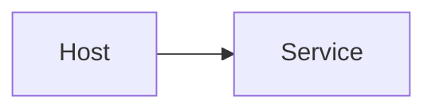

# Blog content guide

How to write posts for this site. Reference style: [velnic.dev example](https://velnic.dev/posts/new-blog-s3-cloudfront-aws-deploy/).

## Folder layout

```
content/blog/
└── posts/
    ├── fr/   # French posts
    └── en/   # English posts
```

- Every article lives under **`posts/`** (both locales)
- Each article exists in **both** `fr/` and `en/` with matching translation slugs in frontmatter
- Optional **`project`** frontmatter groups posts into a series (sidebar nav + `/blog?project=…`)

## Frontmatter

```yaml
---
title: "Article title"
summary: "Short description for listings and SEO"
date: 2025-06-01
fr: slug-en-francais
en: english-slug
draft: false
tags:
  - moodle
  - php
theme: https://www.youtube.com/watch?v=VIDEO_ID#t=42
project: Homelab
---
```

| Field | Required | Notes |
|-------|----------|-------|
| `title` | yes | Display title |
| `summary` | yes | Shown on blog index |
| `date` | yes | `YYYY-MM-DD` |
| `fr` | yes | Slug used in `/blog/posts/fr-slug` when viewing FR |
| `en` | yes | Slug used in `/blog/posts/en-slug` when viewing EN |
| `draft` | no | `true` hides from the blog (default: `false`) |
| `tags` | no | Used for tag filtering on `/blog` |
| `theme` | no | **Full URL** to a background music/video (hash `#` allowed) |
| `project` | no | Series name — enables project nav, breadcrumb, and `?project=` filter |

`theme` must be a URL, not a label:

```yaml
# Good
theme: https://www.youtube.com/watch?v=abc123#t=30

# Bad
theme: moodle
```

## Project collections

Posts that share the same `project` value form a series:

- Sidebar list of sibling posts (oldest → newest)
- Breadcrumb: Blog / Project
- Index filter: `/blog?project=Homelab`

Standalone posts omit `project`.

## Headings and summary

Headings `#`, `##`, and `###` in the body:

- Appear in the **right-hand summary** (table of contents)
- Get anchor links for in-page navigation
- The active section is highlighted while scrolling
- **Ignored inside fenced code blocks** — a `# comment` in a ` ``` ` block will not appear in the summary

The page title in frontmatter is shown separately in the header — the `#` heading in the body is optional but recommended for the summary.

## Mermaid diagrams

Fenced `mermaid` blocks are rendered as diagrams (not as code):

````markdown

````

Theme follows the site light/dark mode. Invalid syntax falls back to an error + raw source.

## Callouts

Use GitHub alert syntax (same as velnic.dev):

```markdown
> [!NOTE]
> Information readers should notice.

> [!TIP]
> Optional helpful advice.

> [!IMPORTANT]
> Crucial information.

> [!WARNING]
> Risk or caution.

> [!CAUTION]
> Negative consequences of an action.
```

## Code blocks

```markdown
```bash title="Install dependencies"
npm install
```
```

Optional modifiers go in the fence meta (after the language):

| Tag | Effect |
|-----|--------|
| `title="…"` | Custom header label |
| `{1,3-5}` or `highlight="1,3-5"` | Highlight those lines |
| `is-terminal` | Terminal-style chrome |
| `no-title` | Hide the language/title bar |

## Images

Markdown images render as a `blog-image` figure: gradient frame and shadow by default, optional caption inside the frame. Put files under `public/` and reference them with a root path:

```markdown

```

The **alt text** is only for screen readers — it is not shown on the page. Use a caption (below) for visible text.

### Size and frame

Optional modifiers go in the image **title** (quoted string after the URL), separated by spaces or commas:

| Tag | Effect |
|-----|--------|
| `size-small` | Image max width ~14rem |
| `size-medium` | Image max width ~20rem (default) |
| `size-big` | Image max width ~48rem |
| `no-background` | No gradient frame or shadow |

**Size tags apply to the image only**, not the caption. The image stays centred inside the frame; with a caption, the caption bar spans the full width of the card.

Without a caption, the frame wraps tightly around the image. With a caption, the frame stretches to the full prose width — the image keeps its size limit, the caption sits below it inside the same background.

### Captions

Add a caption after ` | ` in the title (tags on the left, caption on the right). You can also use `caption:` when there are no other tags:

```markdown
")


```

Captions render in italic inside the frame, below the image, with a shared border between image and caption.

## Inline formatting

```markdown
**bold** and *italic*

[link text](https://example.com)

[Rybbit](https://rybbit.io "icon")
[Beszel](https://beszel.dev "icon: sh/beszel")
[Dockhand](https://github.com/Finsys/dockhand "icon: si/github")

- bullet list
- second item

1. numbered list
2. second item

| Column | Value |
|--------|-------|
| Key    | Data  |
```

Optional link title tags (same idea as image titles):

| Tag | Effect |
|-----|--------|
| `icon` | Try `/icon.svg` → `/favicon.ico` → Google s2 → DuckDuckGo |
| `icon: si/github` | [Simple Icons](https://simpleicons.org) slug (white in dark theme) |
| `icon: si/github/white` | Simple Icons with an explicit color |
| `icon: sh/rybbit` | [selfh.st/icons](https://github.com/selfhst/icons) (auto `-light` on dark UI / `-dark` on light) |
| `icon: sh/rybbit-dark` | Exact selfh.st slug |
| `icon: /path.svg` or `icon:https://…` | Custom icon URL |

Without a title tag, links stay plain text (no icon).

Tables, strikethrough (`~~text~~`), and task lists (`- [ ] todo`) are supported via GFM.

## Full example

```markdown
---
title: "My article"
summary: "A short summary."
date: 2026-03-15
fr: mon-article
en: my-article
draft: false
tags:
  - web
theme: https://www.youtube.com/watch?v=example
project: Homelab
---

# My article

Intro paragraph with **bold** text.

> [!NOTE]
> A note for the reader.

## First section

```bash title="Install dependencies"
npm install
```

## Conclusion

Final thoughts.
```

## Checklist before publishing

- [ ] Both `fr/` and `en/` files exist
- [ ] `fr` / `en` slugs in frontmatter match the other locale's filename
- [ ] `draft: false` (or omit) when ready
- [ ] Tags are lowercase and consistent across locales
- [ ] Images live under `public/` and use root paths
- [ ] Series posts share the same `project` string in both locales

## Common mistakes

- Mismatched `fr` / `en` slugs between translation files — language switch won't find the counterpart page
- Putting images outside `public/` — they won't be served
- Using a label instead of a URL for `theme`
