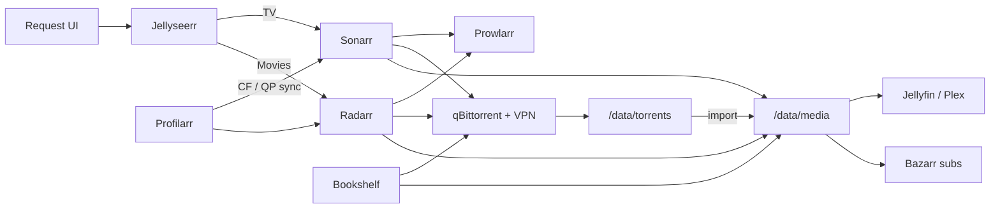

Once the Proxmox host and the Caddy edge existed, media still meant clicking around indexers and hoping paths lined up. The *arr stack turns that into a pipeline: **request → search → download → import → playback**.

This writeup is the automation layer on a dedicated LXC, plus a separate download CT on VPN. Playback (Jellyfin / Plex) only consumes the finished library.

> [!NOTE]
> Paths and IPs below are patterns (`/data/...`, `192.168.x.x`). No indexer names, API keys, or real LAN addresses.

## Topology

Two containers, one bulk disk:


| Piece            | Role                                                                               |
| ---------------- | ---------------------------------------------------------------------------------- |
| **arr CT**       | Docker Compose: Sonarr, Radarr, Prowlarr, Bazarr, Jellyseerr, Bookshelf, Profilarr |
| **download CT**  | qBittorrent behind a VPN tunnel                                                    |
| **Bulk storage** | Host directory store bind-mounted as `/data` (torrents + media library)            |


Keeping downloads on their own CT isolates the VPN and port-forward mess from the *arr apps. Both CTs must see the **same** `/data` tree so hardlinks and imports work.




## What runs in the compose stack

All on the arr CT under something like `/opt/arr-stack/`:


| Service                  | Job                                                                    |
| ------------------------ | ---------------------------------------------------------------------- |
| **Prowlarr**             | Indexer manager shared by the *arrs                                    |
| **Sonarr**               | TV: search, grab, import to `/data/media/tv`                           |
| **Radarr**               | Movies: same idea → `/data/media/movies`                               |
| **Bazarr**               | Subtitles against `/data/media`                                        |
| **Jellyseerr**           | Request UI in front of Sonarr / Radarr                                 |
| **Profilarr** (+ parser) | Sync custom formats and quality profiles (here: French-friendly 1080p) |
| **Bookshelf**            | Audiobook automation (Readarr-class) → `/data/media/audiobooks`        |


Common env on LinuxServer-style images: matching `PUID` / `PGID`, and a real `TZ`. Config volumes live next to the compose file; library data does **not**.

## Paths: the part that actually matters

If download path and library path are on different filesystems, you get copies instead of hardlinks, stalled imports, and permission pain. One bind mount for the whole tree:

```text title="/data layout on the bulk store"
/data/
├── torrents/
│   ├── incomplete/
│   ├── movies/      # Radarr category
│   ├── tv/          # Sonarr category
│   └── books/       # Bookshelf / audiobooks
└── media/
    ├── movies/
    ├── tv/
    ├── audiobooks/  # Author/Title/
    └── books/       # ebooks if you add a second instance
```


| Consumer                           | Mount                   |
| ---------------------------------- | ----------------------- |
| Sonarr / Radarr / Bookshelf / qBit | `/data` (full tree)     |
| Bazarr                             | `/data/media` is enough |
| Jellyfin / Plex (other CTs)        | `/data/media` only      |


> [!IMPORTANT]
> Sonarr, Radarr, qBit, and Bookshelf must agree on path **strings** inside the containers (`/data/torrents/...` → `/data/media/...`). Same mount, same spelling.


## Downloads: qBittorrent on VPN

qBit sits on the download CT with:

- VPN as the **only** network interface for the client (no accidental clearnet seeding).
- A **fixed listen port** aligned with the VPN port forward.
- Categories that match the *arr save paths (`tv-sonarr`, movie category, `books-audiobook` → `/data/torrents/books`, and so on).

Sonarr / Radarr / Bookshelf talk to qBit over the LAN API. They never need to sit inside the VPN.

> [!TIP]
> When seeding fails, check VPN up, port forward, and that qBit is bound to the tunnel interface before you blame the *arr apps.


## Profilarr and French releases

Profilarr pushes custom formats and quality profiles into Sonarr / Radarr so you are not hand-editing scores forever. In this lab the baseline is a compact **1080p** profile with French release priority (MULTI, TRUEFRENCH, VFF, and friends).

Worth remembering: custom format scores **add up**. Huge language bonuses can drown small codec penalties, so spot-check grabs after a sync.

## Bookshelf for audiobooks

Bookshelf (Hardcover metadata image) replaced a LazyLibrarian setup. One instance = one media type; this one is audiobooks under `/data/media/audiobooks` with `Author/Title/` on disk. Ebooks would be a second container if needed.

Same rule as the rest: downloads land under `/data/torrents/books`, then import into the library tree on the same volume.

## Compose shape (sketch)

Not a full dump of a live file. The shape is enough to rebuild:

```yaml title="docker-compose.yml · sketch"
services:
  prowlarr:
    image: lscr.io/linuxserver/prowlarr:latest
    volumes:
      - ./prowlarr-config:/config
    ports: ["9696:9696"]
    restart: unless-stopped

  sonarr:
    image: lscr.io/linuxserver/sonarr:latest
    environment:
      - PUID=1000
      - PGID=1000
      - TZ=Europe/Paris
    volumes:
      - ./sonarr-config:/config
      - /data:/data
    ports: ["8989:8989"]
    restart: unless-stopped

  radarr:
    image: lscr.io/linuxserver/radarr:latest
    environment:
      - PUID=1000
      - PGID=1000
      - TZ=Europe/Paris
    volumes:
      - ./radarr-config:/config
      - /data:/data
    ports: ["7878:7878"]
    restart: unless-stopped

  # bazarr, jellyseerr, bookshelf, profilarr + parser…
```

Wire Prowlarr apps, download clients, and root folders in the UIs after `docker compose up -d`. Caddy `*.internal` hostnames for these UIs can come later; direct `IP:port` is fine while the stack settles.

## Checkpoint

- Arr CT running the compose stack; download CT running qBit on VPN.
- Both see the same `/data` bind from bulk storage.
- Categories and root folders match the torrent / media layout.
- Jellyseerr can request into Sonarr / Radarr; a test grab imports without a manual move.
- Profilarr health OK; profiles visible in Sonarr / Radarr.
- Players only mount `/data/media` (read the library, not the incomplete torrents).


## Recap

The *arr stack is less about collecting containers and more about **one shared** `/data` **tree** plus a download CT that stays on VPN. Requests hit Jellyseerr, indexers go through Prowlarr, grabs land in `/data/torrents`, imports land in `/data/media`, and the players never need to know how the file got there.