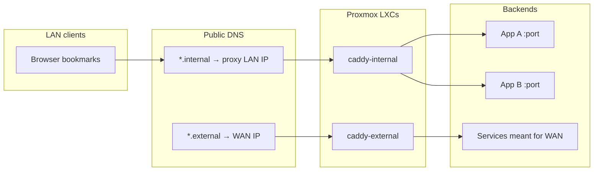

With Proxmox up, the next pain was bookmarks full of `http://192.168.x.x:port`. I wanted stable hostnames, HTTPS on the LAN, and a tiny public surface for the few services that must face the internet.

The pattern is two zones and **two Caddy containers**:


| Zone         | Pattern                  | Who should reach it      |
| ------------ | ------------------------ | ------------------------ |
| **Internal** | `*.internal.example.com` | LAN (and later VPN) only |
| **External** | `*.external.example.com` | The internet, on purpose |


> [!NOTE]
> Hostnames and addresses use placeholders (`example.com`, `192.168.x.x`).


## Why two proxies

One reverse proxy can do everything. Separating **internal** and **external** made the blast radius clearer:

- Misconfiguring an internal vhost does not open a WAN port.
- Public TLS (Let's Encrypt) lives only on the external CT.
- LAN services can use `tls internal` (Caddy's local CA) without fighting ACME from a private IP.




Both Caddies are small Debian LXCs (about 512 MiB each). They only reverse-proxy; apps stay on their own containers.

## DNS: public records, private targets

I did not stand up a split-horizon DNS server on day one. Registrar DNS is enough if you are honest about what each zone means.

### `*.internal`

1. Create an **A record** per service hostname (or a handful of names you care about).
2. Point every internal A record at the **LAN IP of caddy-internal** (for example `192.168.x.200`).
3. Do **not** point them at each backend CT.

On the home LAN, `jellyfin.internal.example.com` resolves to the proxy. Off-LAN, that private A record is useless unless you are on VPN. That is intentional for the internal zone.

```text title="Example internal A records"
jellyfin.internal.example.com  →  192.168.x.200
vault.internal.example.com     →  192.168.x.200
dash.internal.example.com      →  192.168.x.200
proxmox.internal.example.com   →  192.168.x.200
```

> [!IMPORTANT]
> Many hostnames, **one** A target (the internal proxy). The `Host` header picks the Caddy site block; Caddy picks the backend.


### `*.external`

1. Create A records for the few names that must be public.
2. Point them at your **WAN IP** (or a dynamic DNS name that tracks it).
3. On the router, forward **443** (and 80 if you want HTTP-01) to **caddy-external** on the LAN.

```text title="Example external A records"
vpn.external.example.com       →  <wan-ip>
analytics.external.example.com →  <wan-ip>
```

Keep `*.external` sparse. If a service does not need strangers on the internet, it stays in `*.internal`.

## Caddy internal: `tls internal`

On the internal CT, every site block looks roughly like this:

```caddy title="/etc/caddy/Caddyfile · internal"
jellyfin.internal.example.com {
	tls internal
	reverse_proxy 192.168.x.10:8096
}

vault.internal.example.com {
	tls internal
	reverse_proxy 192.168.x.20:8080
}
```

`tls internal` uses Caddy's local CA. Browsers will warn until you trust that CA on your devices (or accept the risk on a private LAN). The win is zero ACME chatter for hostnames that only resolve to a private IP.

Reload after edits:

```bash is-terminal title="On caddy-internal"
systemctl reload caddy
```


### Upstream quirks worth knowing

Some backends speak HTTPS themselves (Proxmox UI on `:8006`). Proxy them explicitly and skip verify for the LAN hop if you are terminating TLS again at Caddy:

```caddy title="HTTPS upstream example"
proxmox.internal.example.com {
	tls internal
	reverse_proxy https://192.168.x.x:8006 {
		transport http {
			tls_insecure_skip_verify
		}
	}
}
```

Apps that split API and UI on two ports can use `handle` blocks:

```caddy title="Path-based upstreams"
app.internal.example.com {
	tls internal
	encode zstd gzip
	handle /api/* {
		reverse_proxy 192.168.x.30:3001
	}
	handle {
		reverse_proxy 192.168.x.30:3002
	}
}
```


## Caddy external: public TLS

The external Caddyfile has **no** `tls internal`. Caddy obtains public certificates (Let's Encrypt / ACME) for those hostnames because DNS points at a reachable address and port 443 lands on this CT.

```caddy title="/etc/caddy/Caddyfile · external"
vpn.external.example.com {
	reverse_proxy 192.168.x.40:8080
}

analytics.external.example.com {
	encode zstd gzip
	handle /api/* {
		reverse_proxy 192.168.x.30:3001
	}
	handle {
		reverse_proxy 192.168.x.30:3002
	}
}
```

> [!WARNING]
> Only publish what you are ready to patch. External vhosts are a short list on purpose. Everything else stays behind `*.internal` (and later VPN).


## Adding a new internal service

Checklist I reuse every time:

1. Deploy or note the backend `IP:port` on its CT.
2. Add a site block on **caddy-internal** with `tls internal` + `reverse_proxy`.
3. Add a registrar **A record** → caddy-internal LAN IP.
4. `systemctl reload caddy` on the internal CT.
5. Smoke test from a LAN client:

```bash is-terminal title="Smoke test"
curl -skI https://service.internal.example.com/
```

For an external name, swap in caddy-external, point DNS at the WAN IP, and confirm the port forward before you chase ACME errors.

## Checkpoint

- Two Caddy LXCs: one for LAN (`*.internal`), one for WAN (`*.external`).
- Public DNS A records match that split (private proxy IP vs WAN IP).
- Internal sites use `tls internal`; external sites use public ACME.
- Bookmarks use hostnames, not raw CT IPs.
- A short deploy checklist so the next service does not invent a third pattern.

> [!NOTE]
> Browser bookmarks hit Caddy hostnames. Server-side jobs and dashboards may still call backends by LAN IP in private `.env` files. That is fine; keep those URLs out of the address bar.


## Recap

Two DNS zones, two Caddies: `*.internal` points at the LAN proxy (`tls internal`), `*.external` at the WAN (public ACME). Bookmarks use hostnames; only services you mean to expose go through the external edge.