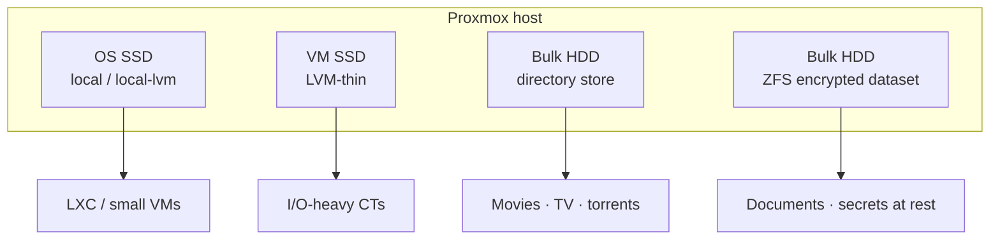

I used to run the house lab on a **Windows Server** install that had grown into a single point of failure: media tools, random Docker leftovers, and “just reboot it” as the main ops skill. I wanted LXC containers, proper storage pools, and a host I could trust. That meant a clean **Proxmox VE** install.

This writeup covers the host only: backup, install, disks, and first boot. Reverse proxy, DNS, and Docker stacks stay for later.

> [!NOTE]
> Addresses below use placeholders (`192.168.x.x`, `<proxmox-ip>`). Treat them as patterns, not a copy-paste inventory of my LAN.

## Why Proxmox

Windows Server was fine until it was not. The tipping points:

- **One OS for everything** - reboots and updates risked every service at once.
- **No cheap isolation** - Hyper-V existed, but LXC-style lightweight containers were what I wanted for reverse proxies and Docker hosts.
- **Storage story** - I needed clear roles: OS SSD, fast VM disks, bulk media, and encrypted space for documents.

Proxmox sits in the middle: Debian-based host, web UI, KVM for VMs, LXC for containers, and first-class storage backends (directory, LVM-thin, ZFS).

## Backup first, then wipe

I did **not** convert the Windows install in place (no P2V gymnastics). Before touching the OS disk I took a proper backup of **Windows Server itself** and the **important data** that lived on it, onto storage that would survive the wipe.

Then:

1. **Inventory** physical disks so you know which SSD becomes the OS and which HDDs become data pools.
2. **Clean install** of Proxmox VE from USB on the target disk.
3. **Mount the backup** on the new host (and later bind-mount paths into containers where needed) to copy configs, documents, and media into the new layout.
4. **Verify**, then reclaim the old Windows disk as Proxmox storage once nothing depended on that mount anymore.

> [!WARNING]
> A Proxmox install will overwrite the target disk. Confirm the device ID (`/dev/sda` vs `/dev/nvme0n1`) before you click through the installer. Wrong disk = bad weekend.

> [!TIP]
> Keep the backup mount read-only while you import. Only wipe or repartition the source once the services that need those files are running from the new pools.


## Disk layout (roles, not brand names)

After a few iterations, the host settled into four roles. Exact models change; the **roles** are what matter.




| Role             | Proxmox storage type               | What lives there                                    |
| ---------------- | ---------------------------------- | --------------------------------------------------- |
| **OS**           | `local` + `local-lvm` on SSD       | Proxmox itself, ISOs, default CT/VM disks           |
| **Fast VM/CT**   | LVM-thin on a second SSD           | Roots that need snappy I/O                          |
| **Bulk / media** | Directory store on HDD             | Large, replaceable data                             |
| **Sensitive**    | ZFS dataset with native encryption | Things that should stay opaque if a disk walks away |


Encrypted ZFS is unlocked with a passphrase after reboot. Until that dataset is available, containers that live on it simply will not start - plan for that.

```bash is-terminal title="Sanity-check storage after install"
ssh root@<proxmox-ip>
pvesm status
lsblk -o NAME,SIZE,TYPE,MOUNTPOINT,FSTYPE
```


## First-boot checklist

After the installer finishes and the host is on a **static LAN IP**:

1. Update the node (`apt update && apt full-upgrade` on current PVE).
2. Set a hostname you can live with for years.
3. Confirm the web UI on port `8006` (HTTPS with the default self-signed cert is fine at first).
4. Create storage entries that match the roles above - empty pools beat mysterious free space.
5. Pick a **CT ID / IP policy** early (for example: proxies in a high `.x` range, apps in another). Write it down.

You do not need a full spreadsheet on day one, but reserve at least the gateway, the Proxmox host, and a block for future containers:


| Role             | Example                           | Notes                          |
| ---------------- | --------------------------------- | ------------------------------ |
| Router / gateway | `192.168.x.1` or `.254`           | Whatever your LAN already uses |
| Proxmox host     | static in the middle of the range | Web UI + SSH                   |
| App containers   | consecutive block                 | Document as you allocate       |


> [!TIP]
> Community helper scripts are useful for spinning Debian + Docker LXCs later. Do not let them invent your storage layout; pass explicit storage IDs that match your pools.


## Checkpoint

- Proxmox installed on a dedicated OS SSD, reachable at a static IP.
- Storage roles registered (`local-lvm`, bulk directory, encrypted ZFS if you need it).
- Backup imported (or at least mounted and verified), old Windows disk reclaimed when safe.
- A written IP allocation note so the next CT does not collide with the host.


## Recap

Windows Server gave way to a clean Proxmox node with **role-based storage**: OS SSD, fast VM disk, bulk media, and encrypted space for what matters. Everything else - proxies, DNS, VPN, media stacks - builds on that host.