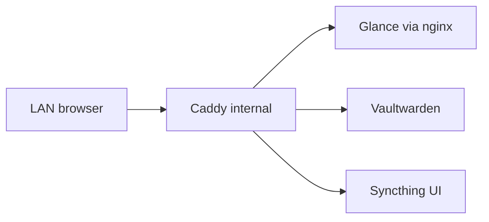

Once DNS and the dual Caddy edge existed, the next habit to kill was a browser full of `http://192.168.x.x:port`. I also wanted a single place for passwords that was not a random SQLite file on a laptop.

That became a Debian Docker LXC: `utils-server`. Small RAM budget (~1 GiB), one compose under `/opt/utils`, internal hostnames only. Site analytics used to live here too; it later moved to its own box. What stayed is the daily glue: dashboard, vault, file sync.

> [!NOTE]
> Hostnames below use `example.com` and `192.168.x.x`. Patterns only. Secrets stay in Vaultwarden and deploy env, never in git.

## What still lives on utils

| Concern | Tool | Audience |
|---------|------|----------|
| Start page / monitors | **[Glance](https://github.com/glanceapp/glance "icon: sh/glance")** (+ nginx front) | LAN only |
| Password manager | **[Vaultwarden](https://github.com/dani-garcia/vaultwarden "icon: sh/vaultwarden")** | LAN only |
| File sync | **[Syncthing](https://syncthing.net "icon: si/syncthing")** | LAN (+ sync ports) |
| Host metrics agent | Beszel agent → hub elsewhere | Outbound to analytics LXC |

Published URLs are all `*.internal.example.com` through the internal Caddy (`tls internal`). No utils hostname on the external proxy on purpose.

## Vaultwarden: the real secret store

[Vaultwarden](https://github.com/dani-garcia/vaultwarden "icon: sh/vaultwarden") is a Bitwarden-compatible server. Clients are the official Bitwarden apps; the server image is the lightweight Rust fork.

On this box it is deliberately boring:

- Image `vaultwarden/server`, data under `./vaultwarden-data`
- `WEBSOCKET_ENABLED` for fast client sync
- `ADMIN_TOKEN` only in `.env` (rotate if it ever leaked)
- Bound on the host as `:8080`, reached as `vault.internal.example.com`

Rules that stuck:

- **Homelab secrets live in Vaultwarden** (and short-lived deploy env). Not in Markdown notes, not in the blog repo.
- **No public vault hostname.** If I need the vault away from home, that is a VPN problem, not a port-forward problem.
- Compose API keys for Glance (Sonarr, Jellyfin, …) stay in `/opt/utils/.env`; the human-facing passwords and recovery codes stay in the vault.

Admin panel stays off until needed. Leaving it open on a LAN hostname is still a footgun if something else on the network is compromised.

## Glance: one dashboard, several pages

[Glance](https://github.com/glanceapp/glance "icon: sh/glance") is YAML-driven. Config is a tree under `./glance-config` mounted at `/app/config`. Pages are split by job:

| Page | Role |
|------|------|
| `home.yml` | Quiet start page |
| `homelab.yml` | Infra monitors, bookmarks, WAN IP, speedtest, releases |
| `media.yml` | *arr, Jellyfin/Plex, qBit, queues |
| `gaming.yml` | Twitch, IGDB-style releases, deals |

The homelab page is the one I open first: left column bookmarks (Proxmox, vault, Syncthing, analytics tools), center column health monitors, right column odds and ends (ipinfo, Tailscale/Headscale status, latest speedtest).

### Why an nginx in front of Glance

Glance itself is not published on a host port. An `nginx:alpine` sidecar (`glance-proxy`) listens on **8085** and proxies to the Glance container. Caddy then points `dash.internal.example.com` at that port.

That split once caused a classic sticky upstream: recreate Glance, nginx keeps a dead upstream, Caddy returns **502** until the proxy restarts. Fix was operational (restart `glance-proxy` with Glance), not a reason to drop the sidecar. Dynamic resolver in nginx is still backlog.

### Widget URLs ≠ bookmark URLs

This is the Glance-specific gotcha. HTTP checks and API widgets run **inside the Glance container** on utils-server.

| Target | What to put in the widget |
|--------|---------------------------|
| Service on **another LXC** | Direct `http://192.168.x.x:port` |
| Service on **the same compose** | Docker DNS name, e.g. `http://vaultwarden:80` |
| Human bookmark / open-in-browser | Caddy hostname, `https://….internal.example.com` |

Cross-LXC Docker names do not resolve from Glance. `http://speedtest-tracker:80` fails; `http://192.168.x.x:8086` works. Same lesson as Beszel agents versus dashboard hostnames: **machines talk over LAN IPs, humans talk over Caddy.**

I also removed the old `docker.sock` mount from Glance. Container stats belong in Beszel now; Glance stays a dashboard, not a second Docker UI.

### Monitors that matter

Server column probes things that should wake me up if red: Proxmox UI, Vaultwarden (`http://vaultwarden:80`), Syncthing, Headscale health. Analytics column probes the other LXC by IP (Beszel hub, Rybbit UI, Speedtest, Dockhand). Bookmarks still use pretty hostnames.

API keys and tokens for *arr / Jellyfin / Twitch / speedtest live in `.env` as names only in docs. Values never leave the host.

## What left the box

Umami (then Rybbit), the Beszel **hub**, and Speedtest Tracker moved to an analytics LXC. Utils only keeps a **Beszel agent** (host network, docker.sock read-only) that phones home to that hub. The dashboard still *links* to analytics tools; it does not run them.

That split was the point: utils stays the thin “open the lab” box. Heavy collectors and image hygiene live elsewhere.

## What stuck

- **Vault on the WAN is a non-goal.** VPN or nothing.
- Glance widgets that copy-paste Caddy URLs for API checks will fail TLS or DNS in subtle ways; prefer direct IP for probes.
- After recreating Glance, restart the nginx sidecar too if dashboards 502.
- One compose directory (`/opt/utils`) with config + data + `.env` is easier to back up than “which CT was that again?”

## Recap

Utils is a small LXC: [Vaultwarden](https://github.com/dani-garcia/vaultwarden "icon: sh/vaultwarden") for secrets, [Glance](https://github.com/glanceapp/glance "icon: sh/glance") for the daily overview, Syncthing for sync, a Beszel agent for host health. Everything user-facing is `*.internal`. Analytics and media stacks get their own boxes; this one stays the foyer.
