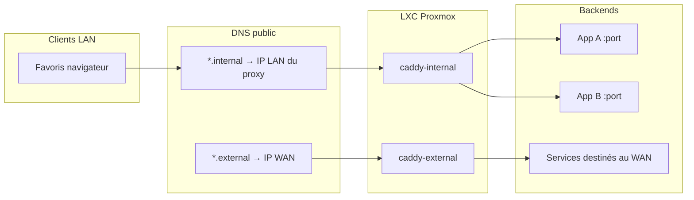

Avec Proxmox en place, la suite c'était des favoris pleins de `http://192.168.x.x:port`. Je voulais des hostnames stables, du HTTPS sur le LAN, et une surface publique minuscule pour les rares services qui doivent voir Internet.

Le motif : deux zones et **deux conteneurs Caddy** :


| Zone        | Motif                    | Qui doit y accéder                |
| ----------- | ------------------------ | --------------------------------- |
| **Interne** | `*.internal.example.com` | LAN (et plus tard VPN) uniquement |
| **Externe** | `*.external.example.com` | Internet, volontairement          |


> [!NOTE]
> Hostnames et adresses sont des placeholders (`example.com`, `192.168.x.x`).


## Pourquoi deux proxies

Un seul reverse proxy peut tout faire. Séparer **interne** et **externe** clarifie le rayon d'explosion :

- Une mauvaise config d'un vhost interne n'ouvre pas de port WAN.
- Le TLS public (Let's Encrypt) vit seulement sur le CT externe.
- Les services LAN peuvent utiliser `tls internal` (CA locale Caddy) sans se battre avec ACME depuis une IP privée.




Les deux Caddy sont de petits LXC Debian (~512 Mo chacun). Ils ne font que du reverse proxy ; les apps restent sur leurs propres conteneurs.

## DNS : enregistrements publics, cibles privées

Pas de DNS split-horizon complet dès le jour 1. Le DNS du registrar suffit si chaque zone dit la vérité.

### `*.internal`

1. Créer un **enregistrement A** par hostname de service (ou pour les noms qui comptent).
2. Pointer chaque A interne vers l'**IP LAN de caddy-internal** (par ex. `192.168.x.200`).
3. **Ne pas** pointer vers chaque CT backend.

Sur le LAN, `jellyfin.internal.example.com` résout vers le proxy. Hors LAN, cet A privé ne sert à rien sans VPN. C'est voulu pour la zone interne.

```text title="Exemples d'enregistrements A internes"
jellyfin.internal.example.com  →  192.168.x.200
vault.internal.example.com     →  192.168.x.200
dash.internal.example.com      →  192.168.x.200
proxmox.internal.example.com   →  192.168.x.200
```

> [!IMPORTANT]
> Beaucoup de hostnames, **une** cible A (le proxy interne). L'en-tête `Host` choisit le bloc Caddy ; Caddy choisit le backend.


### `*.external`

1. Créer des A pour les rares noms qui doivent être publics.
2. Les pointer vers l'**IP WAN** (ou un DNS dynamique qui la suit).
3. Sur le routeur, forward **443** (et 80 si HTTP-01) vers **caddy-external** sur le LAN.

```text title="Exemples d'enregistrements A externes"
vpn.external.example.com       →  <wan-ip>
analytics.external.example.com →  <wan-ip>
```

Gardez `*.external` maigre. Si un service n'a pas besoin d'étrangers sur Internet, il reste en `*.internal`.

## Caddy interne : `tls internal`

Sur le CT interne, chaque bloc ressemble à ça :

```caddy title="/etc/caddy/Caddyfile · interne"
jellyfin.internal.example.com {
	tls internal
	reverse_proxy 192.168.x.10:8096
}

vault.internal.example.com {
	tls internal
	reverse_proxy 192.168.x.20:8080
}
```

`tls internal` utilise la CA locale de Caddy. Les navigateurs râlent tant que vous n'avez pas fait confiance à cette CA (ou accepté le risque sur un LAN privé). Le gain : zéro ACME pour des hostnames qui ne résolvent que vers une IP privée.

Reload après édition :

```bash is-terminal title="Sur caddy-internal"
systemctl reload caddy
```


### Pièges d'upstream utiles

Certains backends parlent déjà HTTPS (UI Proxmox sur `:8006`). Proxifiez-les explicitement et ignorez la vérif TLS sur le hop LAN si vous retenez le TLS côté Caddy :

```caddy title="Exemple d'upstream HTTPS"
proxmox.internal.example.com {
	tls internal
	reverse_proxy https://192.168.x.x:8006 {
		transport http {
			tls_insecure_skip_verify
		}
	}
}
```

Les apps qui séparent API et UI sur deux ports peuvent utiliser des blocs `handle` :

```caddy title="Upstreams par chemin"
app.internal.example.com {
	tls internal
	encode zstd gzip
	handle /api/* {
		reverse_proxy 192.168.x.30:3001
	}
	handle {
		reverse_proxy 192.168.x.30:3002
	}
}
```


## Caddy externe : TLS public

Le Caddyfile externe n'a **pas** de `tls internal`. Caddy obtient des certificats publics (Let's Encrypt / ACME) pour ces hostnames, parce que le DNS pointe vers une adresse joignable et que le port 443 arrive sur ce CT.

```caddy title="/etc/caddy/Caddyfile · externe"
vpn.external.example.com {
	reverse_proxy 192.168.x.40:8080
}

analytics.external.example.com {
	encode zstd gzip
	handle /api/* {
		reverse_proxy 192.168.x.30:3001
	}
	handle {
		reverse_proxy 192.168.x.30:3002
	}
}
```

> [!WARNING]
> Ne publiez que ce que vous êtes prêts à patcher. Les vhosts externes restent une liste courte volontairement. Tout le reste reste derrière `*.internal` (et plus tard le VPN).


## Ajouter un nouveau service interne

Checklist que je réutilise à chaque fois :

1. Déployer ou noter le backend `IP:port` sur son CT.
2. Ajouter un bloc sur **caddy-internal** avec `tls internal` + `reverse_proxy`.
3. Ajouter un **enregistrement A** chez le registrar → IP LAN de caddy-internal.
4. `systemctl reload caddy` sur le CT interne.
5. Smoke test depuis un client LAN :

```bash is-terminal title="Smoke test"
curl -skI https://service.internal.example.com/
```

Pour un nom externe : caddy-external, DNS vers l'IP WAN, et confirmer le port forward avant de chasser les erreurs ACME.

## Point de contrôle

- Deux LXC Caddy : un pour le LAN (`*.internal`), un pour le WAN (`*.external`).
- Des A DNS publics alignés sur ce split (IP privée du proxy vs IP WAN).
- Sites internes en `tls internal` ; sites externes en ACME public.
- Favoris en hostnames, plus en IPs brutes de CT.
- Une checklist courte pour que le prochain service n'invente pas un troisième motif.

> [!NOTE]
> Les favoris navigateur passent par les hostnames Caddy. Les jobs serveur et dashboards peuvent encore appeler les backends en IP LAN dans des `.env` privés. Tant que ces URLs restent hors de la barre d'adresse, c'est bon.


## Récap

Deux zones DNS, deux Caddy : `*.internal` résout vers le proxy LAN (`tls internal`), `*.external` vers le WAN (ACME public). Les favoris utilisent des hostnames ; seuls les services volontairement exposés passent par le bord externe.