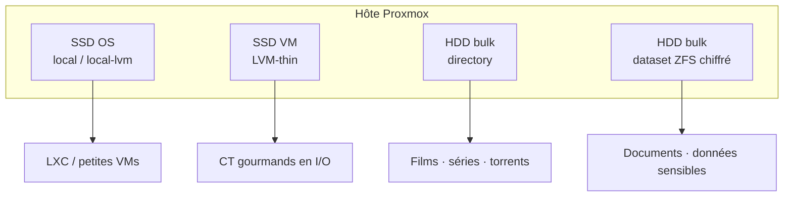

Le lab tournait sur un **Windows Server** devenu point de défaillance unique : outils média, restes Docker, et « redémarre et prie » comme procédure principale. Je voulais des conteneurs LXC, des pools de stockage clairs, et un hôte digne de confiance. Donc une install **Proxmox VE** propre.

Ce writeup ne couvre que l'hôte : sauvegarde, install, disques, premier boot. Reverse proxy, DNS et stacks Docker viendront plus tard.

> [!NOTE]
> Les adresses ci-dessous sont des placeholders (`192.168.x.x`, `<proxmox-ip>`). Ce sont des motifs, pas l'inventaire réel du LAN.

## Pourquoi Proxmox

Windows Server tenait la route jusqu'au moment où ça a coincé :

- **Un seul OS pour tout** - chaque reboot ou maj risquait tous les services.
- **Peu d'isolation légère** - Hyper-V existe, mais les LXC collaient mieux à des proxies et hôtes Docker.
- **Stockage à clarifier** - SSD OS, disques VM rapides, gros volumes média, espace chiffré pour les documents.

Proxmox se place au milieu : hôte Debian, UI web, KVM pour les VMs, LXC pour les conteneurs, backends de stockage (directory, LVM-thin, ZFS).

## Sauvegarder d'abord, puis tout effacer

Pas de conversion en place du Windows (pas de P2V acrobatique). Avant de toucher au disque OS, j'ai fait une vraie sauvegarde de **Windows Server lui-même** et des **données importantes** qui vivaient dessus, sur un stockage qui survivrait au wipe.

Ensuite :

1. **Inventorier** les disques physiques (quel SSD pour l'OS, quels HDD pour les pools).
2. **Install propre** de Proxmox VE depuis une clé USB sur le disque cible.
3. **Monter la sauvegarde** sur le nouvel hôte (puis en bind-mount dans les conteneurs au besoin) pour recopier configs, documents et médias dans le nouveau layout.
4. **Vérifier**, puis recycler l'ancien disque Windows en stockage Proxmox une fois que plus rien ne dépendait de ce montage.

> [!WARNING]
> L'installeur Proxmox écrase le disque cible. Vérifiez l'identifiant (`/dev/sda` vs `/dev/nvme0n1`) avant de valider. Mauvais disque = mauvais week-end.

> [!TIP]
> Gardez le montage de la sauvegarde en lecture seule le temps d'importer. Ne wipez ou ne repartitionnez la source qu'une fois les services branchés sur les nouveaux pools.


## Découpage disque (des rôles, pas des marques)

Après quelques itérations, l'hôte a quatre rôles. Les modèles changent ; les **rôles** restent.




| Rôle              | Type de stockage Proxmox      | Contenu                                          |
| ----------------- | ----------------------------- | ------------------------------------------------ |
| **OS**            | `local` + `local-lvm` sur SSD | Proxmox, ISOs, disques CT/VM par défaut          |
| **VM/CT rapides** | LVM-thin sur un second SSD    | Roots qui ont besoin d'I/O snappy                |
| **Bulk / média**  | Directory sur HDD             | Gros volumes remplaçables                        |
| **Sensible**      | Dataset ZFS chiffré natif     | Ce qui doit rester opaque si le disque disparaît |


Le ZFS chiffré se déverrouille avec une passphrase après reboot. Tant que le dataset n'est pas disponible, les conteneurs qui y vivent ne démarrent pas - à prévoir.

```bash is-terminal title="Vérifier le stockage après install"
ssh root@<proxmox-ip>
pvesm status
lsblk -o NAME,SIZE,TYPE,MOUNTPOINT,FSTYPE
```


## Checklist premier boot

Une fois l'installeur terminé et l'hôte en **IP LAN statique** :

1. Mettre le nœud à jour (`apt update && apt full-upgrade` sur PVE courant).
2. Choisir un hostname tenable sur plusieurs années.
3. Vérifier l'UI web sur le port `8006` (HTTPS avec le certificat auto-signé, suffisant au début).
4. Créer les entrées de stockage alignées sur les rôles ci-dessus - des pools vides valent mieux que de l'espace mystérieux.
5. Définir tôt une **politique d'IDs CT / IPs** (par ex. proxies sur un haut `.x`, apps ailleurs). L'écrire quelque part.

Pas besoin d'un tableur complet le premier jour, mais réservez au minimum la gateway, l'hôte Proxmox, et un bloc pour les futurs conteneurs :


| Rôle                   | Exemple                           | Notes                         |
| ---------------------- | --------------------------------- | ----------------------------- |
| Routeur / gateway      | `192.168.x.1` ou `.254`           | Celui déjà utilisé sur le LAN |
| Hôte Proxmox           | IP statique au milieu de la plage | UI web + SSH                  |
| Conteneurs applicatifs | bloc consécutif                   | Documenter au fur et à mesure |


> [!TIP]
> Les scripts communautaires aident pour des LXC Debian + Docker plus tard. Ne les laissez pas inventer votre layout de stockage ; passez des IDs de storage explicites.


## Point de contrôle

- Proxmox installé sur un SSD OS dédié, joignable en IP statique.
- Rôles de stockage enregistrés (`local-lvm`, directory bulk, ZFS chiffré si besoin).
- Sauvegarde importée (ou au moins montée et vérifiée), ancien disque Windows recyclé quand c'est sûr.
- Une note d'allocation d'IP pour que le prochain CT ne collisionne pas avec l'hôte.


## Récap

Windows Server a laissé place à un nœud Proxmox propre avec un **stockage par rôles** : SSD OS, disque VM rapide, bulk média, et espace chiffré pour ce qui compte. Le reste - proxies, DNS, VPN, stacks média - s'appuie sur cet hôte.