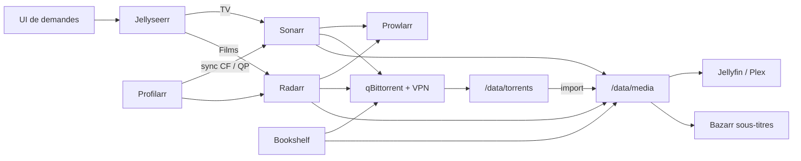

Une fois l'hôte Proxmox et le bord Caddy en place, le média voulait encore dire cliquer dans des indexers et espérer que les chemins collent. La stack *arr en fait un pipeline : **demande → recherche → téléchargement → import → lecture**.

Ce writeup couvre la couche d'automation sur un LXC dédié, plus un CT de download derrière VPN. La lecture (Jellyfin / Plex) ne fait que consommer la bibliothèque finie.

> [!NOTE]
> Chemins et IPs ci-dessous sont des motifs (`/data/...`, `192.168.x.x`). Pas de noms d'indexers, de clés API, ni d'adresses LAN réelles.

## Topologie

Deux conteneurs, un disque bulk :


| Pièce             | Rôle                                                                                |
| ----------------- | ----------------------------------------------------------------------------------- |
| **CT arr**        | Docker Compose : Sonarr, Radarr, Prowlarr, Bazarr, Jellyseerr, Bookshelf, Profilarr |
| **CT download**   | qBittorrent derrière un tunnel VPN                                                  |
| **Stockage bulk** | Directory store hôte monté en `/data` (torrents + bibliothèque)                     |


Séparer les downloads isole le VPN et le port-forward du reste des apps *arr. Les deux CT doivent voir le **même** arbre `/data` pour que hardlinks et imports fonctionnent.




## Ce qui tourne dans le compose

Tout sur le CT arr, sous quelque chose comme `/opt/arr-stack/` :


| Service                  | Job                                                                  |
| ------------------------ | -------------------------------------------------------------------- |
| **Prowlarr**             | Gestionnaire d'indexers partagé                                      |
| **Sonarr**               | Séries : search, grab, import vers `/data/media/tv`                  |
| **Radarr**               | Films : même idée → `/data/media/movies`                             |
| **Bazarr**               | Sous-titres sur `/data/media`                                        |
| **Jellyseerr**           | UI de demandes devant Sonarr / Radarr                                |
| **Profilarr** (+ parser) | Sync des custom formats et quality profiles (ici : 1080p orienté FR) |
| **Bookshelf**            | Automation audiobooks (famille Readarr) → `/data/media/audiobooks`   |


Env commun sur les images type LinuxServer : `PUID` / `PGID` alignés, et un vrai `TZ`. Les volumes de config vivent à côté du compose ; les données bibliothèque **non**.

## Chemins : la partie qui compte vraiment

Si download et bibliothèque sont sur des filesystems différents, tu te retrouves avec des copies au lieu de hardlinks, des imports coincés, et des galères de droits. Un seul bind mount pour tout l'arbre :

```text title="Layout /data sur le store bulk"
/data/
├── torrents/
│   ├── incomplete/
│   ├── movies/      # catégorie Radarr
│   ├── tv/          # catégorie Sonarr
│   └── books/       # Bookshelf / audiobooks
└── media/
    ├── movies/
    ├── tv/
    ├── audiobooks/  # Auteur/Titre/
    └── books/       # ebooks si seconde instance
```


| Consommateur                       | Montage                 |
| ---------------------------------- | ----------------------- |
| Sonarr / Radarr / Bookshelf / qBit | `/data` (arbre complet) |
| Bazarr                             | `/data/media` suffit    |
| Jellyfin / Plex (autres CT)        | `/data/media` seulement |


> [!IMPORTANT]
> Sonarr, Radarr, qBit et Bookshelf doivent être d'accord sur les **chaînes** de chemins dans les conteneurs (`/data/torrents/...` → `/data/media/...`). Même mount, même orthographe.


## Downloads : qBittorrent derrière VPN

qBit vit sur le CT download avec :

- le VPN comme **seule** interface réseau pour le client (pas de seeding en clair par accident) ;
- un **port d'écoute fixe** aligné avec le port-forward VPN ;
- des catégories qui matchent les chemins *arr (`tv-sonarr`, catégorie films, `books-audiobook` → `/data/torrents/books`, etc.).

Sonarr / Radarr / Bookshelf parlent à qBit via l'API LAN. Ils n'ont pas besoin d'être dans le VPN.

> [!TIP]
> Si le seeding casse, vérifie VPN up, port-forward, et le bind qBit sur l'interface tunnel avant d'accuser les apps *arr.


## Profilarr et releases FR

Profilarr pousse custom formats et quality profiles dans Sonarr / Radarr pour éviter d'éditer les scores à la main. Ici le baseline est un profil **1080p** compact avec priorité aux releases FR (MULTI, TRUEFRENCH, VFF, etc.).

À garder en tête : les scores de custom formats **s'additionnent**. De gros bonus langue peuvent noyer de petites pénalités codec ; vérifie quelques grabs après une sync.

## Bookshelf pour les audiobooks

Bookshelf (image Hardcover) a remplacé un setup LazyLibrarian. Une instance = un type de média ; celle-ci gère les audiobooks sous `/data/media/audiobooks` avec `Auteur/Titre/` sur disque. Les ebooks seraient un second conteneur si besoin.

Même règle que le reste : downloads dans `/data/torrents/books`, puis import dans l'arbre bibliothèque sur le même volume.

## Forme du compose (esquisse)

Pas un dump d'un fichier live. La forme suffit pour reconstruire :

```yaml title="docker-compose.yml · esquisse"
services:
  prowlarr:
    image: lscr.io/linuxserver/prowlarr:latest
    volumes:
      - ./prowlarr-config:/config
    ports: ["9696:9696"]
    restart: unless-stopped

  sonarr:
    image: lscr.io/linuxserver/sonarr:latest
    environment:
      - PUID=1000
      - PGID=1000
      - TZ=Europe/Paris
    volumes:
      - ./sonarr-config:/config
      - /data:/data
    ports: ["8989:8989"]
    restart: unless-stopped

  radarr:
    image: lscr.io/linuxserver/radarr:latest
    environment:
      - PUID=1000
      - PGID=1000
      - TZ=Europe/Paris
    volumes:
      - ./radarr-config:/config
      - /data:/data
    ports: ["7878:7878"]
    restart: unless-stopped

  # bazarr, jellyseerr, bookshelf, profilarr + parser…
```

Branchez apps Prowlarr, download clients et root folders dans les UI après `docker compose up -d`. Les hostnames Caddy `*.internal` peuvent venir plus tard ; du `IP:port` direct suffit le temps que la stack se stabilise.

## Point de contrôle

- CT arr avec le compose ; CT download avec qBit sur VPN.
- Les deux voient le même bind `/data` depuis le stockage bulk.
- Catégories et root folders alignés sur le layout torrents / media.
- Jellyseerr peut demander dans Sonarr / Radarr ; un grab de test importe sans déplacement manuel.
- Health Profilarr OK ; profils visibles dans Sonarr / Radarr.
- Les players ne montent que `/data/media` (la bibliothèque, pas les torrents incomplets).


## Récap

La stack *arr, ce n'est pas collectionner des conteneurs : c'est **un arbre** `/data` **partagé** et un CT download qui reste sur VPN. Les demandes passent par Jellyseerr, les indexers par Prowlarr, les grabs atterrissent dans `/data/torrents`, les imports dans `/data/media`, et les players n'ont pas besoin de savoir comment le fichier est arrivé là.