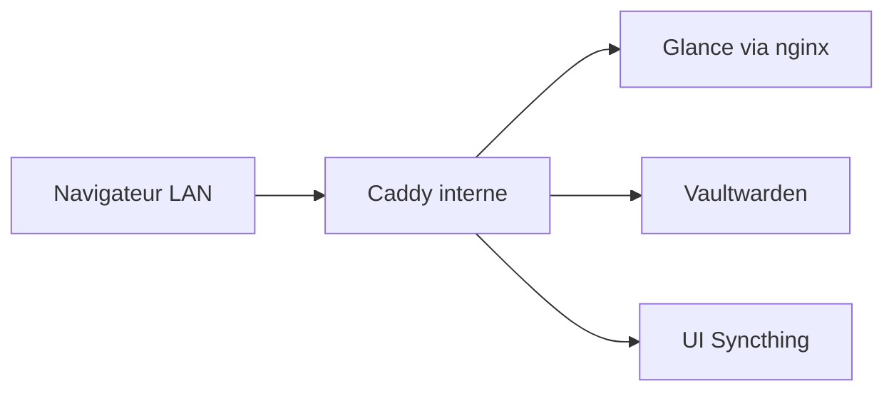

Une fois le DNS et le double bord Caddy en place, la mauvaise habitude à tuer était un navigateur plein de `http://192.168.x.x:port`. Je voulais aussi un seul endroit pour les mots de passe qui ne soit pas un SQLite au hasard sur un laptop.

Résultat : un LXC Debian + Docker, `utils-server`. Petit budget RAM (~1 Go), un compose sous `/opt/utils`, hostnames internes seulement. Les analytics du site ont vécu ici un temps, puis ont déménagé. Ce qui reste, c'est la colle du quotidien : dashboard, coffre, sync de fichiers.

> [!NOTE]
> Les hostnames ci-dessous utilisent `example.com` et `192.168.x.x`. Des motifs seulement. Les secrets restent dans Vaultwarden et l'env de deploy, jamais dans git.

## Ce qui vit encore sur utils

| Besoin | Outil | Audience |
|--------|-------|----------|
| Page d'accueil / sondes | **[Glance](https://github.com/glanceapp/glance "icon: sh/glance")** (+ front nginx) | LAN seulement |
| Gestionnaire de mots de passe | **[Vaultwarden](https://github.com/dani-garcia/vaultwarden "icon: sh/vaultwarden")** | LAN seulement |
| Sync de fichiers | **[Syncthing](https://syncthing.net "icon: si/syncthing")** | LAN (+ ports sync) |
| Agent métriques hôte | Agent Beszel → hub ailleurs | Sortant vers le LXC analytics |

Les URLs publiées sont toutes en `*.internal.example.com` via le Caddy interne (`tls internal`). Aucun hostname utils sur le proxy externe, volontairement.

## Vaultwarden : le vrai coffre

[Vaultwarden](https://github.com/dani-garcia/vaultwarden "icon: sh/vaultwarden") est un serveur compatible Bitwarden. Les clients sont les apps Bitwarden officielles ; l'image serveur est le fork Rust léger.

Sur cette boîte, c'est volontairement ennuyeux :

- Image `vaultwarden/server`, données sous `./vaultwarden-data`
- `WEBSOCKET_ENABLED` pour une sync client rapide
- `ADMIN_TOKEN` uniquement dans `.env` (à régénérer s'il fuit)
- Écouté en `:8080` sur l'hôte, joignable en `vault.internal.example.com`

Règles qui sont restées :

- **Les secrets du lab vivent dans Vaultwarden** (et l'env de deploy éphémère). Pas dans des notes Markdown, pas dans le dépôt du blog.
- **Pas de hostname vault public.** Si j'ai besoin du coffre hors de la maison, c'est un problème de VPN, pas de port-forward.
- Les clés API Compose pour Glance (Sonarr, Jellyfin, …) restent dans `/opt/utils/.env` ; les mots de passe humains et codes de récupération restent dans le coffre.

Le panneau admin reste éteint tant qu'on n'en a pas besoin. Le laisser ouvert sur un hostname LAN reste un piège si autre chose sur le réseau est compromis.

## Glance : un dashboard, plusieurs pages

[Glance](https://github.com/glanceapp/glance "icon: sh/glance") est piloté en YAML. La config est une arborescence sous `./glance-config` montée sur `/app/config`. Les pages sont découpées par métier :

| Page | Rôle |
|------|------|
| `home.yml` | Page d'accueil calme |
| `homelab.yml` | Sondes infra, favoris, IP WAN, speedtest, releases |
| `media.yml` | *arr, Jellyfin/Plex, qBit, files |
| `gaming.yml` | Twitch, sorties style IGDB, promos |

La page homelab est celle que j'ouvre en premier : colonne gauche de favoris (Proxmox, vault, Syncthing, outils analytics), centre avec les sondes de santé, droite pour le reste (ipinfo, statut Tailscale/Headscale, dernier speedtest).

### Pourquoi un nginx devant Glance

Glance lui-même n'est pas publié sur un port hôte. Un sidecar `nginx:alpine` (`glance-proxy`) écoute en **8085** et reverse-proxy vers le conteneur Glance. Caddy pointe ensuite `dash.internal.example.com` sur ce port.

Ce split a déjà produit un upstream collant classique : recreate Glance, nginx garde un upstream mort, Caddy renvoie **502** jusqu'au restart du proxy. Correctif opérationnel (restart `glance-proxy` avec Glance), pas une raison de virer le sidecar. Un resolver dynamique côté nginx est encore au backlog.

### URLs widget ≠ URLs favoris

C'est le piège spécifique à Glance. Les checks HTTP et widgets API tournent **dans le conteneur Glance** sur utils-server.

| Cible | Quoi mettre dans le widget |
|-------|----------------------------|
| Service sur **un autre LXC** | `http://192.168.x.x:port` en direct |
| Service sur **le même compose** | Nom Docker, ex. `http://vaultwarden:80` |
| Favori / ouvrir dans le navigateur | Hostname Caddy, `https://….internal.example.com` |

Les noms Docker cross-LXC ne résolvent pas depuis Glance. `http://speedtest-tracker:80` échoue ; `http://192.168.x.x:8086` marche. Même leçon que pour les agents Beszel versus les favoris : **les machines parlent en IP LAN, les humains parlent en Caddy.**

J'ai aussi retiré l'ancien mount `docker.sock` de Glance. Les stats conteneurs sont dans Beszel maintenant ; Glance reste un dashboard, pas une deuxième UI Docker.

### Sondes qui comptent

La colonne serveur sonde ce qui doit me réveiller si c'est rouge : UI Proxmox, Vaultwarden (`http://vaultwarden:80`), Syncthing, health Headscale. La colonne analytics sonde l'autre LXC par IP (hub Beszel, UI Rybbit, Speedtest, Dockhand). Les favoris gardent les jolis hostnames.

Clés API et tokens (*arr / Jellyfin / Twitch / speedtest) vivent dans `.env` : les docs ne listent que les noms. Les valeurs ne quittent pas l'hôte.

## Ce qui a quitté la boîte

Umami (puis Rybbit), le **hub** Beszel et Speedtest Tracker sont partis sur un LXC analytics. Utils ne garde qu'un **agent Beszel** (host network, docker.sock en lecture seule) qui rappelle ce hub. Le dashboard **lien** encore vers les outils analytics ; il ne les exécute plus.

Ce split était le but : utils reste la boîte fine « ouvrir le lab ». Collectors lourds et hygiène d'images vivent ailleurs.

## Ce qu'il fallait retenir

- **Vault sur le WAN n'est pas un objectif.** VPN ou rien.
- Des widgets Glance qui collent des URLs Caddy pour des checks API cassent TLS ou DNS de façons subtiles ; préférer l'IP directe pour les sondes.
- Après un recreate Glance, restart aussi le sidecar nginx si le dash 502.
- Un seul répertoire compose (`/opt/utils`) avec config + data + `.env` se sauvegarde mieux que « c'était sur quel CT déjà ? ».

## Récap

Utils, c'est un petit LXC : [Vaultwarden](https://github.com/dani-garcia/vaultwarden "icon: sh/vaultwarden") pour les secrets, [Glance](https://github.com/glanceapp/glance "icon: sh/glance") pour la vue du jour, Syncthing pour la sync, un agent Beszel pour la santé de l'hôte. Tout le user-facing est en `*.internal`. Analytics et stacks média ont leurs propres boîtes ; celle-ci reste le vestibule.
